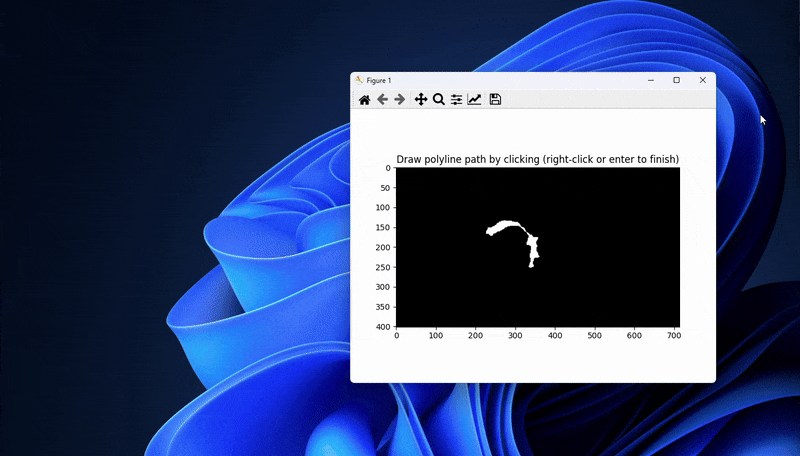

# Area Function Calculation Along Polyline Path

This Python script allows users to **draw a polyline path** on a 2D segmentation image (in `.png` format) and computes the **area function** along the path using **perpendicular cuts** at each point along the polyline. The function then visualizes the results by plotting:

- The **input image** with the drawn polyline and perpendicular cuts.
- The **area function** along the polyline path, both in raw and smoothed forms.

## How It Works:

1. **Load Image**: The script loads a segmentation image in `.png` format and converts it into a binary mask.
2. **Draw Polyline Path**: The user clicks on the image to define a polyline path. A **minimum of 5 points** is required to define the path.
3. **Compute Area Function**: For each point on the polyline, the script calculates the area along perpendicular cuts at each segment.
4. **Smooth Area Function**: A **Savitzky–Golay filter** is applied to smooth the raw area function.
5. **Visualization**: The script shows:
   - The **input image** with the polyline and the perpendicular cuts.
   - The **raw and smoothed area functions** plotted against the distance along the polyline path.

Here's a quick demo of how the script works:



## Usage:

1. **Run the Script**: Execute the Python script in your preferred environment (such as Jupyter Notebook or a Python IDE).

2. **Provide Input**: When prompted, select your segmentation image (e.g., `SampleAirway.png`).

3. **Draw the Polyline**: Click on the image to define the path. You must click **at least 5 points** to create the polyline. Right-click or press **Enter** to finish.

4. **Results**: The script will:
   - Display the image with the polyline and perpendicular cuts.
   - Plot the **raw and smoothed area function** along the path.

## Requirements:

- Python 3.x
- Required libraries:
  - `numpy`
  - `matplotlib`
  - `scipy`
  - `PIL` (Pillow)

You can install the necessary dependencies with `pip`:

```bash
pip install numpy matplotlib scipy pillow
```
